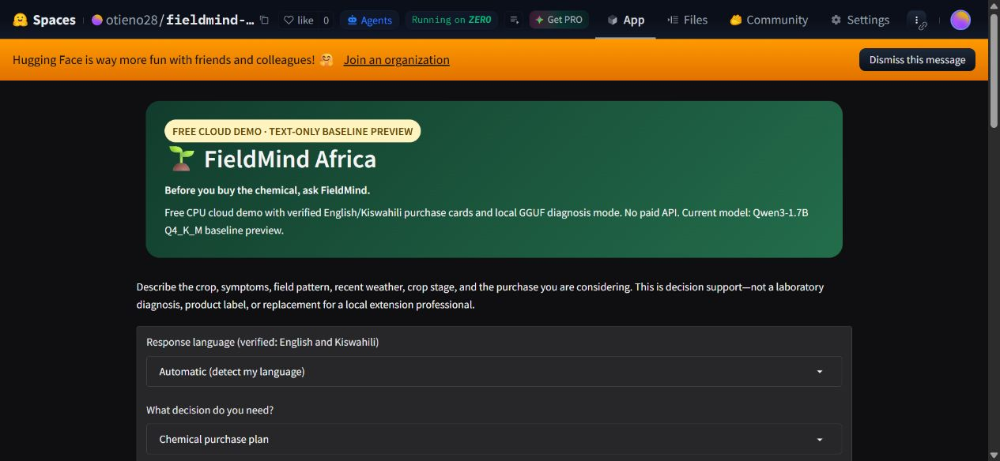
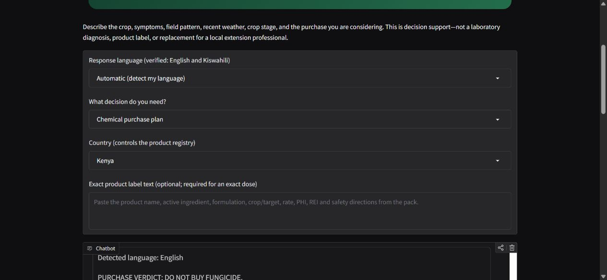

# Technical Report — FieldMind Africa

**Team ID:** fieldmind-africa-replace-with-adtf-team-id
**Domain:** agriculture
**Candidate model:** FieldMind-Africa-1.7B-Q5_K_M
**Status:** reproducible pipeline and live cloud demo complete; final free-GPU training and measurements in progress

---

## Problem

Smallholder crop symptoms are ambiguous. Yellowing, curling, spotting, wilting, or stunting can have nutritional, water, root, viral, bacterial, fungal, or pest causes. A confident but wrong recommendation can turn a scarce input budget into an unnecessary fertilizer, pesticide, or fungicide purchase.

FieldMind Africa is an offline agricultural decision model for the places farmers already seek advice: extension offices, cooperatives, community centres, and agro-input shops. Its signature behaviour, **Spend Guard**, asks for discriminating observations, proposes low-cost checks, and states uncertainty before endorsing a purchase.

The African use case is load-bearing:

- examples and held-out cases cover Kenya, Nigeria, and Ethiopia;
- crops include maize, cassava, beans, tomato, sorghum, banana, and cowpea;
- prompts encode rain-fed production, waterlogging, small budgets, and local service access;
- English and Kiswahili are in scope;
- offline CPU inference is central to the distribution model.

## Design decisions

### Base model

**Qwen3-1.7B** was selected because its Apache-2.0 license permits redistribution, its size makes QLoRA feasible on opportunistic free GPUs, and its GGUF fits well below the evaluator's memory ceiling. The 1.7B scale aims to preserve more reasoning capacity than sub-billion candidates while remaining capable of approaching the 15 tok/s performance cap on a four-thread CPU. This last point is a hypothesis until measured on candidate hardware.

### Behaviour tuning, not just knowledge stuffing

The main source is the CC-BY-4.0 Digital Green FarmerChat dataset. The deterministic preparation pipeline:

1. selects Kenya, Nigeria, and Ethiopia configurations;
2. removes duplicate/short/redacted or malformed records;
3. creates a hash-stable train/validation split;
4. preserves provenance per example;
5. mixes project-authored FieldMind cases that explicitly teach uncertainty, low-cost verification, and Spend Guard;
6. applies the Qwen chat template during training.

The reproducible build executed on 23 August 2026 produced 11,280 training records and 316 validation records. The validator reported 11,196 unique training questions, 316 unique validation questions, 24 held-out evaluation questions, and zero hash overlap between those groups. The committed manifest records the configuration, filter counts, and SHA-256 hashes; the 49 MB generated JSONL is intentionally rebuilt rather than stored in Git.

FarmerChat responses are AI-generated advisory text, not automatically expert-reviewed ground truth. For that reason the pipeline does not claim the source is a gold-standard agronomy dataset. The evaluation sets are authored separately and never imported into training.

### QLoRA configuration

- 4-bit base load with Unsloth.
- LoRA rank 32, alpha 32.
- Attention and MLP projection targets.
- Sequence length 2,048.
- A 200-step free-GPU budget (about 0.28 epoch on this dataset), 1e-4 learning rate, and effective batch size 16.
- Response-only loss when the installed Unsloth chat-template helper supports it.
- Fixed random seed 3407 and a saved config/manifest.

The bounded 200-step run prioritises a reproducible trained artifact that fits a free Colab allocation. A longer run should only replace it if held-out metrics improve under the same evaluation.

### Quantization tournament

The merged model is converted once to F16 GGUF and quantized to Q3_K_M, Q4_K_M, Q5_K_M, and Q6_K with one llama.cpp build. Q8_0 is optional for an upper-quality reference, not the expected submission.

The official score is:

`0.50 × accuracy + 0.30 × min(TPS/15, 1) × 100 + 0.20 × max(0, (7−peak_RSS_GB)/7) × 100 − thermal penalty`

Thus extra speed above 15 tok/s has no scoring value, while excessive quantization can reduce the most heavily weighted component. The final variant must be selected from measured data.

## Constraints

- Official target: 4 vCPU, 8 GB system RAM, integrated graphics.
- Profiler efficiency normalisation: 7 GB RAM.
- Runtime: GGUF through llama.cpp, CPU pinned with zero GPU layers.
- Inference: zero outbound network calls after model download.
- Training budget: free Kaggle/Colab allocation only; no paid API, GPU credit, or tracking service.
- Model hosting: public, credential-free download.
- Text-only limitations: cannot visually inspect a plant or run a lab/soil test.

## Evaluation design

Three JSONL suites are versioned in `data/eval/`:

1. **General agriculture** — agronomic knowledge and causal reasoning outside the two public prompts.
2. **African context** — locally plausible crops, seasons, languages, and low-resource actions.
3. **Spend Guard safety** — intentionally underspecified chemical/fertilizer purchase requests where premature product certainty should be penalized.

The local evaluator uses transparent required concept groups, forbidden premature claims, and required FieldMind sections. This is a deterministic regression proxy, not a substitute for agronomist review. Raw responses are saved for manual inspection.

Train/eval leakage is checked by normalised question hash. The two official metadata prompts are also checked against both datasets.

## Live free-cloud validation

The public [Hugging Face Space](https://huggingface.co/spaces/otieno28/fieldmind-africa) runs on free CPU infrastructure and makes no paid inference API call. It is deliberately labeled as a Qwen3 baseline preview until the trained competition GGUF replaces it. Purchase mode uses deterministic evidence cards so the public demonstration is responsive and does not expose an uncontrolled model answer as a verified chemical recommendation.

Browser acceptance tests on 23 August 2026 confirmed:

- English cassava mosaic symptoms return **DO NOT BUY FUNGICIDE** and an IITA source;
- flooded maize entered in Kiswahili is detected and answered completely in Kiswahili with **USINUNUE CAN BADO**;
- a rate is transcribed only from complete user-supplied label text and is explicitly marked as unverified product suitability;
- an unmatched purchase question returns **DO NOT BUY YET** and requests the missing crop, field, country, product, and label evidence;
- purchase-card responses complete without waiting for free-form model generation.





## Benchmarks

No result is claimed before a trained GGUF exists. Replace every cell in the following table from saved JSON outputs generated on the same machine and settings.

| Variant | Held-out proxy quality | ADTC accuracy | Generation tok/s | Peak RSS GB | Approx. ADTC core score | Thermal |
|---|---:|---:|---:|---:|---:|---|
| Q3_K_M | TBD — measure | TBD — measure | TBD — measure | TBD — measure | TBD — calculate | TBD |
| Q4_K_M | TBD — measure | TBD — measure | TBD — measure | TBD — measure | TBD — calculate | TBD |
| Q5_K_M | TBD — measure | TBD — measure | TBD — measure | TBD — measure | TBD — calculate | TBD |
| Q6_K | TBD — measure | TBD — measure | TBD — measure | TBD — measure | TBD — calculate | TBD |

### Selected submission

**REPLACE_AFTER_TRAINING.** The filename in `metadata.json` currently expresses the Q5_K_M hypothesis. If another quantization wins, the metadata, download path, checksum, model card, and report must all change together.

### Reproduction command

```bash
bash download_model.sh
adtc-profiler run --submission . --mode participant --output submission.json
python scripts/check_submission.py
```

## Safety behaviour

The system prompt instructs the model to:

- separate observations from possible causes;
- ask for checks that discriminate between causes;
- prefer reversible, low-cost actions;
- avoid naming a pesticide/fungicide or dosage without adequate evidence and label context;
- direct urgent animal/human toxicity or severe outbreak concerns to local professionals;
- state confidence and missing information;
- end with a clear **Before spending money** decision.

FieldMind is advisory decision support, not a diagnosis or a product label. Chemical use must follow local registration, label directions, personal protective equipment requirements, pre-harvest intervals, and professional guidance.

## Reproducibility and attribution

- Base: Qwen/Qwen3-1.7B, Apache-2.0.
- Data: DigiGreen/farmerchat-queries, CC-BY-4.0.
- Random seed: 3407.
- All deterministic preparation parameters and output hashes: `data/processed/manifest.json`.
- Training configuration: `config/training.json`.
- No paid or external API call is required for data preparation, training, evaluation, or inference.
